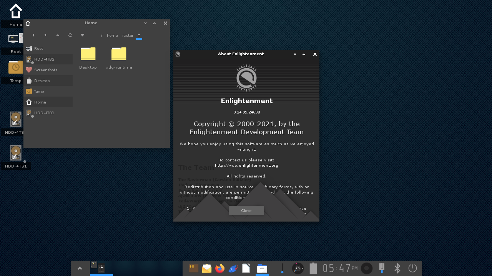

# NixOS Flake System configuration

                    __    
              /\    \ \  /\
              \ \    \ \/ /
            ___\ \____\  /   /\     ___     _                 ___     ____
           /___________\ \  / /    |   \   | |               / _ \   / __ \
               / /      \ \/ /____ | |\ \  | | ( )          / / \ \ / /  \/
         _____/ /        \/ _____/ | | \ \ | |  _  __    __ | | | | \ \___
        /____/ /\        / /       | |  \ \| | | | \ \  / / | | | |  \___ \
            / /\ \______/_/____    | |   \   | | |  \ \/ /  | | | |      \ \
           / /  \ \_____  ____/    | |    \  | | |  / /\ \  \ \_/ / /\___/ /
           \/   /  \    \ \        |_|     \_| |_| /_/  \_\  \___/  \_____/
               / /\ \    \ \
               \/  \_\    \/       ==========================================

## HOSTS

<pre>
timber-hearth - AMD 5600g/6600xt custom desktop for hosting and development
dark-bramble  - Lenovo Thinkpad P52s used for development
attlerock     - BOSGAME N100 mini PC for Home Theater
</pre>

## DESKTOP ENVIRONMENT
[www.enlightenment.org](https://www.enlightenment.org/)

*** TODO Finish system configuration
-Learn home-manager for config files
-Configure a window manager with rofi, eww, picom, etc...
-Figure out system theming

## HOSTNAME POOL

|     Outer Wilds     | Resident Evil | Final Fantasy |
| ------------------- | ------------- | ------------- |
| Timber Hearth       | Progenitor    | Eorzea        |
| Dark Bramble        | Tyrant        | Hydaelyn      |
| Attlerock           | Uroboros      | Zordiark      |
| Interloper          | Chrysalid     | Aether        |
| Brittle Hollow      | Los Plagas    |               |
| Ash Twin            | Golgotha      |               |
| Ember Twin          | Mycorrhiza    |               |
| Giant's Deep        |               |               |
| Quantum Moon        |               |               |
| Hollow's Lantern    |               |               |
| Eye of The Universe |               |               |
| The Stranger        |               |               |
| Nomai               |               |               |
| Hearthian           |               |               |
| Chert               |               |               |
| Esker               |               |               |
| Feldspar            |               |               |
| Gabbro              |               |               |
| Riebeck             |               |               |
| Solanum             |               |               |