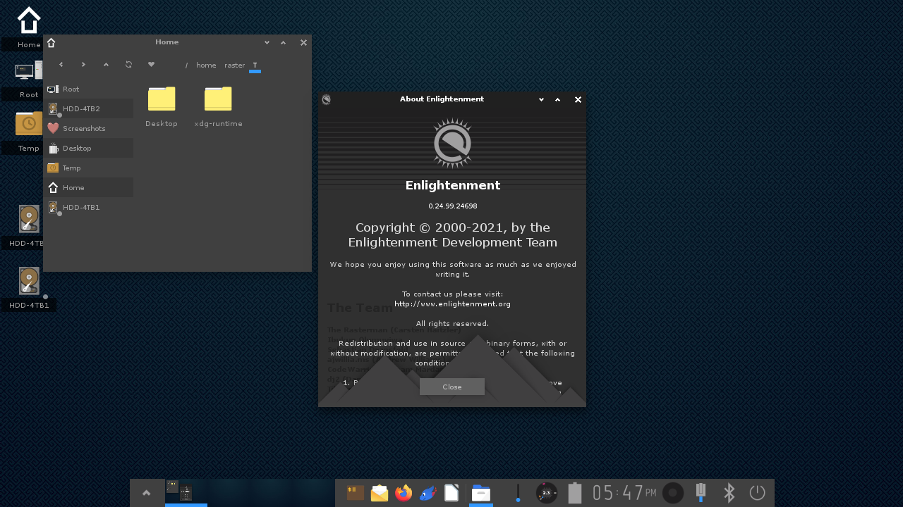

# NixOS Flake System configuration

                    __    
              /\    \ \  /\
              \ \    \ \/ /
            ___\ \____\  /   /\     ___     _   _               ___     ____
           /___________\ \  / /    |   \   | | (_)             / _ \   / __ \
               / /      \ \/ /____ | |\ \  | |  _   __    __  / / \ \ / /  \/
         _____/ /        \/ _____/ | | \ \ | | | |  \ \  / /  | | | | \ \___
        /____/ /\        / /       | |  \ \| | | |   \ \/ /   | | | |  \___ \
            / /\ \______/_/____    | |   \   | | |   / __ \   | | | |      \ \
           / /  \ \_____  ____/    | |    \  | | |  / /  \ \  \ \_/ | /\___/ /
           \/   /  \    \ \        |_|     \_| |_| /_/    \_\  \___/  \_____/
               / /\ \    \ \
               \/  \_\    \/       ==========================================

## HOSTS

**timber-hearth** - AMD 5600g/6600xt custom desktop for hosting and development\
**dark-bramble**  - Lenovo Thinkpad P52s used for development\
**attlerock**     - BOSGAME N100 mini PC for Home Theater

## DESKTOP ENVIRONMENT
Enlightenment 

[[Heading 2]]

test reference

[[hed:three]]
[[hed:three][Reference to Hostnames]]

[[docs/test.org][Test file link]]

** Heading 2

*** TODO Finish system configuration
-Learn home-manager for config files
-Configure a window manager with rofi, eww, picom, etc...
-Figure out system theming

*** Possible Hostnames or users:
:PROPERIES:
:CUSTOM_ID: hed:three
:END:
-Timber Hearth
-Dark Bramble
-Attlerock
-Interloper
-Brittle Hollow
-Ash Twin
-Ember Twin
-Giant's Deep
-Quantum Moon
-Hollow's Lantern
-Eye of The Universe
-The Stranger
-Nomai
-Hearthian
-Chert
-Esker
-Feldspar
-Gabbro
-Riebeck
-Solanum